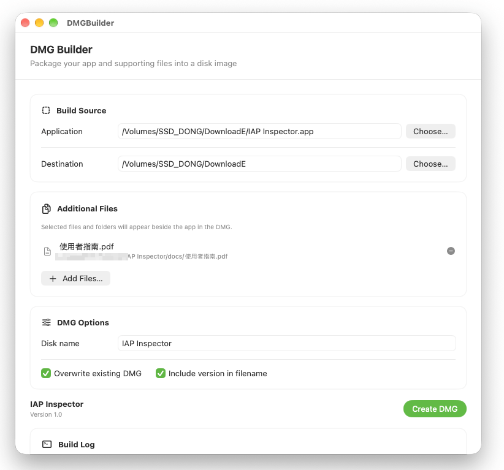

# DMG Builder

A native macOS GUI for creating a `.dmg` from an existing macOS `.app` bundle. It provides a point-and-click alternative to the [`create-dmg` command-line tool](https://github.com/sindresorhus/create-dmg), so you can choose the app, destination, and optional files or folders without running `create-dmg` commands in Terminal. The app stages the selected items in a temporary folder, adds an `/Applications` shortcut, and asks macOS's built-in `hdiutil` to create a compressed, read-only UDZO image. Additional items appear beside the app at the root of the mounted image.




## Requirements and assumptions

- macOS 13 (Ventura) or later to run the app.
- Xcode 15 or later to build the project.
- A compiled macOS `.app` bundle to package. This project creates the DMG; it does not build, sign, or notarize the app being packaged.
- The selected output directory must already exist and be writable.
- `/usr/bin/hdiutil`, which is included with macOS.
- No Node.js, npm, Homebrew, `create-dmg` installation, or other separate command-line tools are needed to use this GUI app.

> **Implementation note:** This app is an alternative front end, not a wrapper around the `create-dmg` package. It invokes `/usr/bin/hdiutil create` directly. The `create-dmg` project is a separate Node.js command-line tool; its name in this app's failure-status message does not indicate a dependency.

## Build

1. Open `DMGBuilder.xcodeproj` in Xcode.
2. Select the `DMGBuilder` scheme and a macOS run destination.
3. Build and run the app with **Product → Run** (or press **⌘R**).

The project uses SwiftUI and targets macOS 13. It has no external package dependencies.

## `create-dmg` command-line alternative

If you prefer to use the original command-line tool, it requires Node.js 20 or later and npm. Install it globally with:

```sh
npm install --global create-dmg
```

Then pass a compiled `.app` bundle and, optionally, a destination directory:

```sh
create-dmg "/path/to/My App.app" "/path/to/output"
```

For example, `create-dmg "My App.app" Build/Releases`. See the [`create-dmg` README](https://github.com/sindresorhus/create-dmg#readme) for its options, including overwrite behavior, filename versioning, DMG title, and code signing. Installing `create-dmg` is only necessary when using that separate CLI; it is not a prerequisite for this GUI project.

## Use

1. Choose the compiled `.app` bundle you want to distribute.
2. Choose an existing destination folder for the output DMG.
3. Optionally add files or folders. Each selected item is placed at the top level of the mounted image, alongside the app.
4. Set the disk image volume name and choose whether to overwrite an existing DMG and include the app version in the filename.
5. Click **Create DMG**. The output is named after the app, optionally followed by its `CFBundleShortVersionString`, and saved in the selected destination folder.

The generated image contains the app, any additional items, and an `Applications` shortcut. The build log displays output from `hdiutil`; after a successful build, use **Show in Finder** to locate the DMG.
